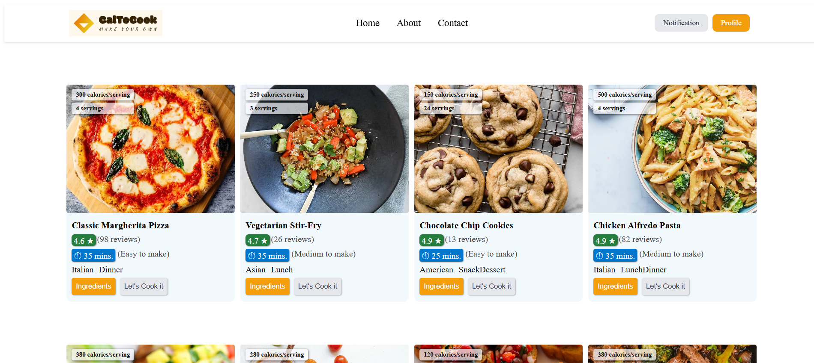
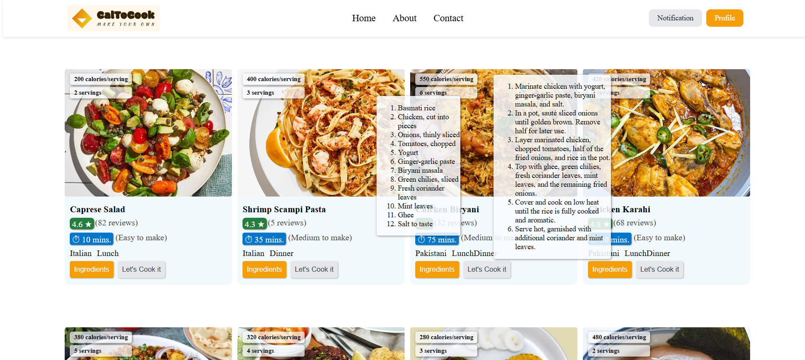
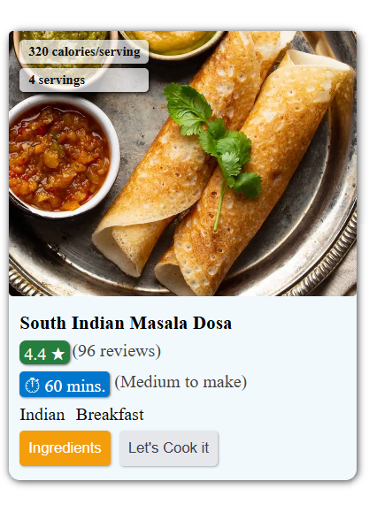
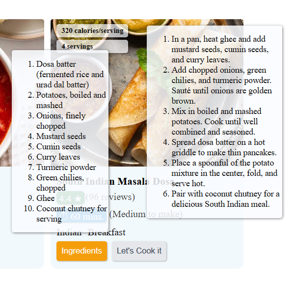
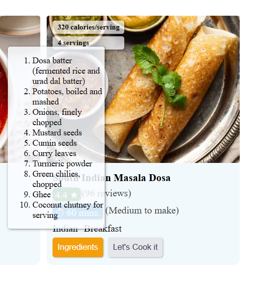
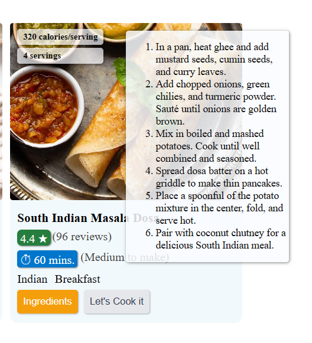

# Group-05

# 🍽️ CalToCook – Make Your Own!

**CalToCook: "Calories To Cook"** is a modern React-based food recipe web application that allows users to explore various delicious dishes with calorie details, preparation time, and cooking instructions.

## ✨ Features
- 🍕 Interactive recipe cards with calorie and serving info
- ⭐ User ratings and reviews
- ⏱️ Estimated cooking time and difficulty
- 🍔 Cuisine and meal type
- 📋 Click **"Ingredients"** to reveal the full ingredient list
- 📖 Click **"Let's Cook it"** to view detailed instructions
- 🚀 Smooth hover transitions on cards and buttons for enhanced UI/UX


## 🖼️ Preview









## 🚀 Getting Started

### Prerequisites

- Node.js and npm installed

### Installation

```bash
git clone https://github.com/abhi-170/Assignments.git
cd caltocook
npm install
npm run dev
