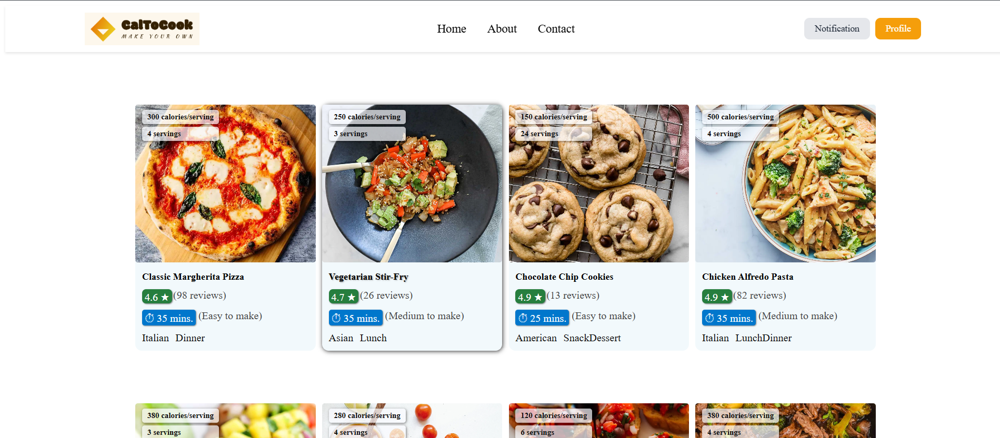
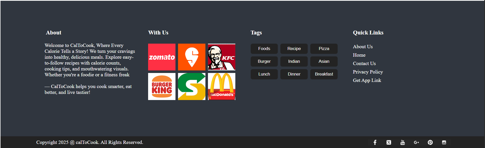
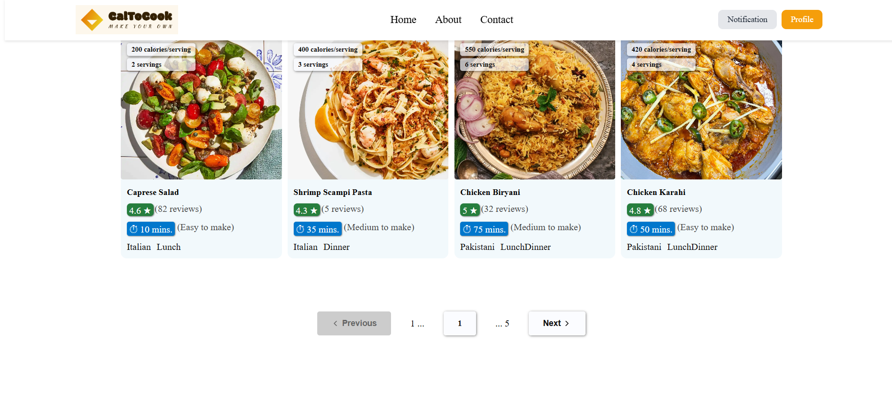
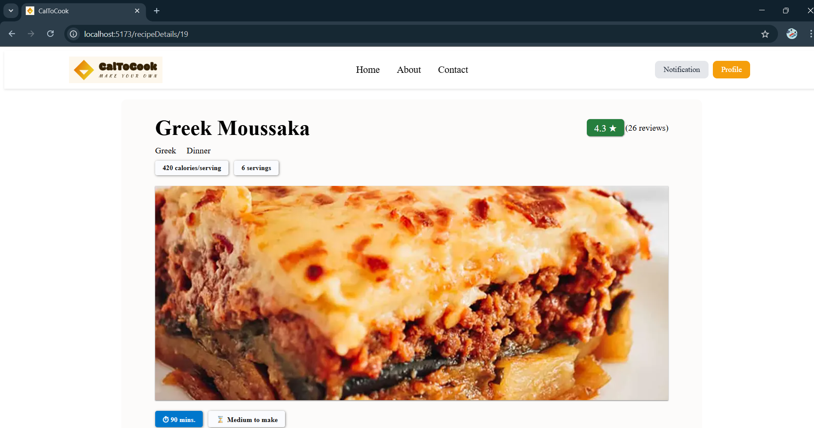
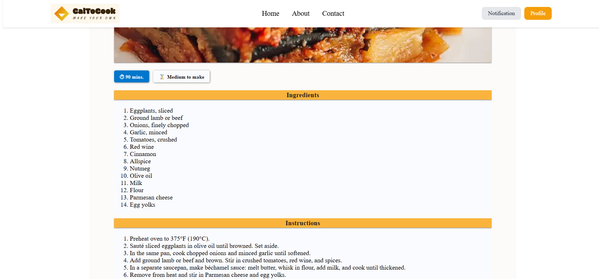
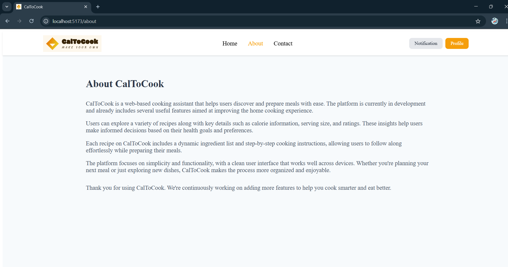
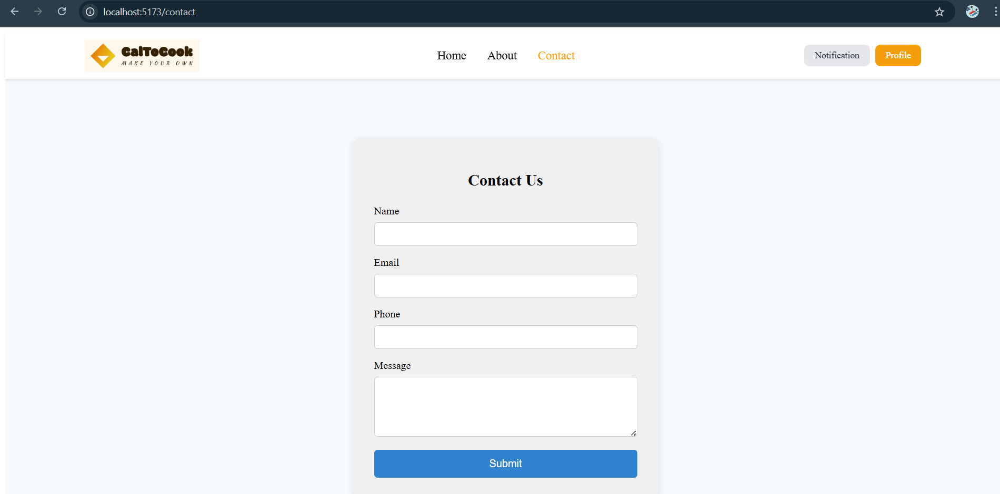

# Group-05

# 🍽️ CalToCook – Make Your Own!

**CalToCook: "Calories To Cook"** is a modern React-based food recipe web application that allows users to explore various delicious dishes with calorie details, preparation time, and cooking instructions.

## ✨ Features
- 🍕 Interactive recipe cards with calorie and serving info
- ⭐ User ratings and reviews
- ⏱️ Estimated cooking time and difficulty
- 🍔 Cuisine and meal type
- 📋 Click on **card** to reveal the full ingredient list and to view detailed instructions.
- 🚀 Smooth hover transitions on cards and buttons for enhanced UI/UX


## 🖼️ Preview

## 1. HOME PAGE:



## 2. FOOTER: 



## 3. PAGINATION: 



## 4. CARD'S DETAILED VIEW:




## 5. ROUTING:





## 🚀 Getting Started

### Prerequisites

- Node.js and npm installed

### Installation

```bash
git clone "link"
cd caltocook
npm install
npm run dev
